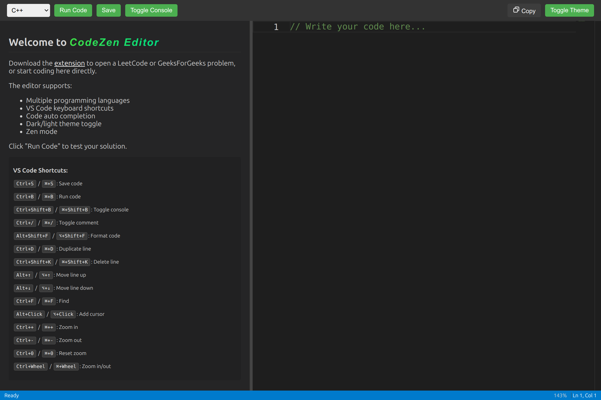

# CodeZen Editor - Browser Extension Documentation

## Overview
CodeZen Editor is a browser extension and web-based code editor designed to enhance your experience while solving data structures and algorithms problems from platforms like **LeetCode** and **GeeksForGeeks**. It provides a **VS Code-like** environment to write and test your solutions.

## Features
- **One-Click Problem Transfer**: Open problems from LeetCode or GeeksForGeeks directly in a customized editor.
- **VS Code-Like Interface**: Familiar coding environment powered by Monaco Editor.
- **Multi-Language Support**: Code in C++, Java, Python, JavaScript, and more.
- **Smart Code Extraction**: Automatically extracts only the solution part you need to implement.
- **Intelligent Cursor Positioning**: Places your cursor exactly where you need to start coding.
- **Dark Theme**: Eye-friendly design for extended coding sessions.
- **Back to Problem Navigation**: Easily return to the original problem page.
- **Code Preservation**: Your code remains in the editor even when switching tabs.
- **Syntax Highlighting**: Language-specific code coloring.
- **Auto-completion**: Context-aware code suggestions.
- **Zoom Functionality**: Adjust text size with mouse wheel.
- **Console Output**: View your code execution results.

---

## Installation
### **Manual Installation (Chrome & Edge)**
1. Download the extension from **[GitHub Releases](https://github.com/DebakantPradhan/codeFlow/releases/latest)**.
2. Unzip the downloaded file.
3. Open Chrome and navigate to `chrome://extensions/`.
4. Enable **Developer mode** using the toggle in the top-right corner.
5. Click **Load unpacked** and select the extracted folder.
6. The extension is now installed and ready to use!

---

## Usage
### **Opening Problems in DSA Editor**
#### **From LeetCode:**
1. Navigate to any problem page on **LeetCode**.
2. Click the **"Open in VS Code Editor"** button near the problem title.
3. The problem will open in DSA Editor.

#### **From GeeksForGeeks:**
1. Navigate to any problem page on **GeeksForGeeks**.
2. Click the **"Open in VS Code Editor"** button near the problem title.
3. The problem will open in DSA Editor.

---

## Editor Interface

### **Main Components:**
- **Problem Description**: View the complete problem statement on the left panel.
- **Code Editor**: Write your solution in the center panel.
- **Console Output**: See execution results in the bottom panel.
- **Toolbar**: Access common actions at the top.
- **Status Bar**: View editor status and position information at the bottom.

---

## Key Features
### **Language Selection**
Choose your preferred programming language from the dropdown menu in the toolbar.

### **Running Your Code**
Click the **Run** button or press `Ctrl+Enter` to execute your solution.

### **Back to Problem**
Click the **Back to Problem** button in the toolbar to return to the original problem page.

### **Zoom In/Out**
Use `Ctrl + Mouse Wheel` to adjust the editor font size.

### **Console Actions**
- **Clear Console Output**: Click the **Clear** button.
- **Copy Console Output**: Click the **Copy** button.

---

## Keyboard Shortcuts
| Action | Shortcut |
|--------|----------|
| Run Code | `Ctrl + Enter` |
| Save | `Ctrl + S` |
| Find | `Ctrl + F` |
| Replace | `Ctrl + H` |
| Comment/Uncomment | `Ctrl + /` |
| Indent | `Tab` |
| Outdent | `Shift + Tab` |
| Zoom In | `Ctrl + Mouse Wheel Up` |
| Zoom Out | `Ctrl + Mouse Wheel Down` |

---

## Technical Details
### **Supported Languages**
- C++
- Java
- Python
- JavaScript
- More coming soon!

### **Browser Compatibility**
- **Chrome** 88+
- **Edge** 88+
- **Firefox** 86+ (coming soon)

### **Project Architecture**
#### **Browser Extension:**
- Injects buttons into LeetCode and GeeksForGeeks problem pages.
- Extracts problem details, description, and starter code.
- Communicates with the editor web app.

#### **Editor Web Application:**
- **Monaco-based code editor** with VS Code features.
- **Problem description renderer**.
- **Code execution environment**.
- **Console output display**.

---

## Troubleshooting
### **Button Not Appearing**
✔ Refresh the page.
✔ Make sure you're on a valid problem page.
✔ Disable and re-enable the extension.

### **Code Not Loading**
✔ Check if you're connected to the internet.
✔ Try opening a different problem.
✔ Clear your browser cache.

### **Back to Problem Button Not Working**
✔ Make sure the original problem tab is still open.
✔ Try using the browser's back button instead.

---

## Roadmap
✅ **Code Testing**: Run your solution against test cases.
✅ **Local Storage**: Save your solutions locally.
✅ **Multiple Solutions**: Store different approaches for the same problem.
✅ **Custom Templates**: Create and use your own code templates.
✅ **Firefox Support**: Expand browser compatibility.
✅ **Time & Space Complexity Analyzer**: Get feedback on your solution's efficiency.

---

## Feedback & Contributions
We welcome your feedback and contributions to make DSA Editor better:

- **Report Issues**: Submit bugs on our **[GitHub Issues](#)** page.
- **Feature Requests**: Let us know what would make the editor more useful.
- **Code Contributions**: Submit pull requests to help improve functionality.

## License & Usage  
This project is **free to use, modify, and distribute**. Attribution is appreciated but not required.  

## Acknowledgements
- **Monaco Editor** - The code editor that powers VS Code.
- **LeetCode** - The leading platform for coding interview preparation.
- **GeeksForGeeks** - Computer science portal with quality programming content.

---

> 🚀 **Start solving DSA problems more efficiently with DSA Editor!**
